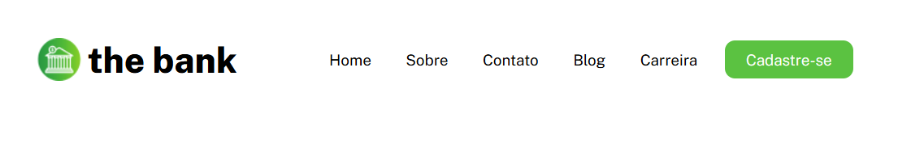
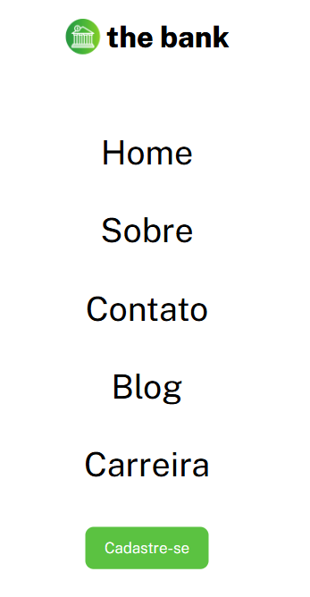

# Menu com flexbox (thebank) mobile first
Igual o exercício anterior, porém este foi feito o modo primeiro para celulares, achei super interessante, e levei apenas uma hora pra faze-lo. Achei ele mais interessante de realizar que o desktop first, pois parece ter menas chances de quebrar o código.

## Tecnologias utilizadas
- HTML
- CSS